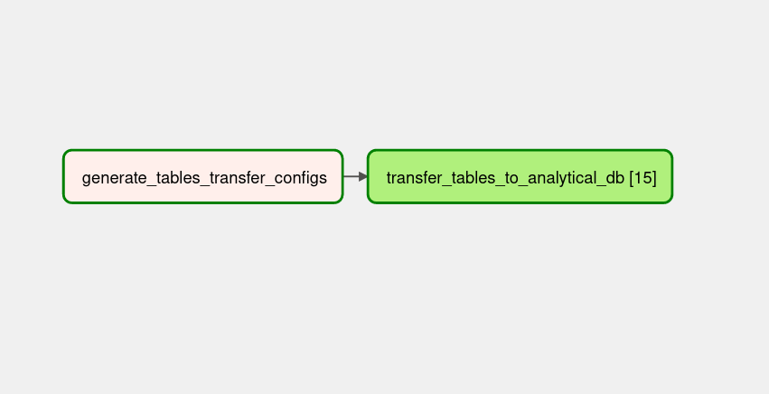

#  Airflow Dvdrental Pipeline

Airflow dvdrental pipeline é uma pipeline Extract-and-Load desenvolvida inteiramente em Python utilizando a framework de orquestração de dados Apache Airflow que coleta dados de tabelas de um banco transacional e 
os insere em um banco de analytics:

O projeto consiste apenas numa simples e concisa DAG e o script de orquestração da mesma pode ser achado no caminho "dags/populate_analytical_db.py". Segue uma imagem do DAG no Airflow UI:

A lógica da DAG é baseada no conceito de criação dinâmica de tasks
do Airflow.

ATENCAO:
as conexoes dos bancos de dados podem ser setadas manualmente usando o
Airflow UI, ou executando o setup_connections.py dentro do container
airflow_worker.

## Como executar

1. execute o script start.sh

2. insira as conexões dos bancos de dados usando o
Airflow UI, ou executando o setup_connections.py dentro do container
airflow_worker.

3. acione o trigger da dag

## Fontes

- [Create dynamic Airflow tasks](https://docs.astronomer.io/learn/dynamic-tasks)

- [Dynamic Task Mapping](https://airflow.apache.org/docs/apache-airflow/2.3.0/concepts/dynamic-task-mapping.html)

---

### Estrutura de Pastas

    .
    ├── dags
    │     ├── populate_analytical_db.py        # a DAG
    ├── data
    │     ├── dvdrental.sql
    ├── include                             
    │     ├── sql                            # pasta onde se destinam os arquivos .sql utilizados
    │       ├── analytical
    │       │   ├── ..sql files
    │       ├── transactional  
    │       │   ├── ..sql files   
    ├── logs                     
    ├── plugins                             # pasta destinada aos sensors e operators customizados (vazio)
    │     ├── operators
    │     ├── sensors
    ├── tests                               # pasta onde estão os testes automatizados
    │    ├── unit_tests
    │    ├── validation_tests
    │    ├── conftest.py
    ├── docker-compose-dev.yml              # docker-compose de desenvolvimento (com pytest para rodar os testes)
    ├── docker-compose.yml                  # docker-compose
    ├── setup_airflow.sh                    # instala o airflow da maquina e roda ele pela primeira vez
    ├── setup_connections.py                # seta as conexões dos bancos de dados
    ├── .gitignore
    ├── CHALLENGE.md
    ├── start.sh
    └── README.md
